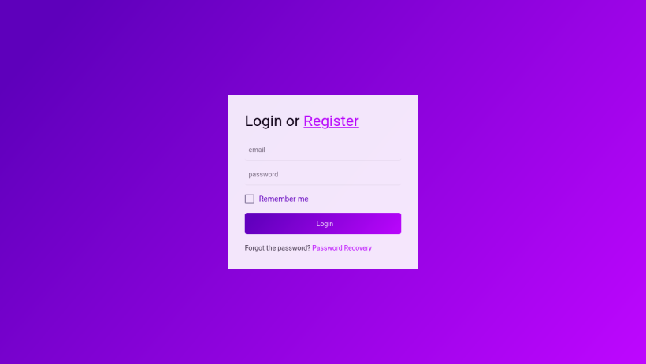

# Authentication PHP



**| Language:** PHP

**| Database:** SQLite

**| Server:** Apache

**| Dependency Manager:** Composer

**| Dependencies:** Phinx, Faker, PHPMailer

---

## Setup

### go to the project folder

```bash
cd www
```

### create a ".env" file and complete it based in the ".env.example"

```bash
touch .env
```

### install composer packages

```bash
composer update
```

### run migrations and seeds

```bash
vendor/bin/phinx migrate
vendor/bin/phinx seed:run
```

### if you are using linux change the db owner to "www-data" and add "rwx" permission to the project

```bash
sudo chown www-data db.sqlite
sudo chmod 777 .
```

### return to the main folder

```bash
cd ..
```

### start docker-compose

```bash
docker-compose up
```

### Done!!!
